# Git 워크플로우 가이드

## 🌿 **브랜치 전략**

Overhaul 시스템은 **Git Flow** 기반의 브랜치 전략을 사용합니다.

### **브랜치 구조**
```
main (production)     ← 운영 환경 배포
├── dev (development) ← 개발 환경 배포
└── feature/*         ← 기능 개발 (필요시)
```

### **브랜치별 역할**
- **`main`**: 운영 환경 (Production)
- **`dev`**: 개발 환경 (Development)
- **`feature/*`**: 개별 기능 개발 (선택사항)

## 🚀 **개발 워크플로우**

### **1. 개발 단계 (dev 브랜치)**
```bash
# 1. 개발 브랜치로 체크아웃
git checkout dev

# 2. 변경사항 작업
# - 코드 수정
# - 마이그레이션 파일 추가
# - UI 개선 등

# 3. 변경사항 커밋 (영어로!)
git add .
git commit -m "feat: Add user management system"

# 4. 개발 환경에 푸시
git push origin dev
```

### **2. 자동 배포 트리거**
```bash
git push origin dev
# ↓
# 🚀 GitHub Actions 자동 실행
# ↓
# 1. overhaul-as-system-dev Worker 배포
# 2. overhaul-as-system-dev DB 마이그레이션
# 3. overhaul-frontend-dev Pages 배포
```

### **3. 개발 환경 테스트**
```bash
# 개발 환경 URL에서 테스트
🌐 Frontend: https://overhaul-frontend-dev.pages.dev
🔧 API: https://overhaul-as-system-dev.ravit-cloud.workers.dev

# 문제없으면 다음 단계로
```

## 🚀 **운영 배포 워크플로우**

### **1. 운영 환경 배포**
```bash
# 1. main 브랜치로 체크아웃
git checkout main

# 2. dev 브랜치를 main에 머지
git merge dev

# 3. 운영 환경에 푸시
git push origin main
```

### **2. 자동 운영 배포 트리거**
```bash
git push origin main
# ↓
# 🚀 GitHub Actions 자동 실행
# ↓
# 1. overhaul-as-system-prod Worker 배포
# 2. overhaul-as-system-prod DB 마이그레이션
# 3. overhaul-frontend-prod Pages 배포
```

### **3. 운영 환경 확인**
```bash
# 운영 환경 URL에서 최종 확인
🌐 Frontend: https://overhaul-frontend-prod.pages.dev
🔧 API: https://overhaul-as-system-prod.ravit-cloud.workers.dev
```

## 🔄 **전체 워크플로우 요약**

### **개발 → 테스트 → 운영 흐름**

```mermaid
graph LR
    A[코드 작성] --> B[dev 브랜치 커밋]
    B --> C[dev 푸시]
    C --> D[개발 환경 자동 배포]
    D --> E[개발 환경 테스트]
    E --> F[main에 머지]
    F --> G[운영 환경 자동 배포]
    G --> H[운영 환경 확인]
```


### **시간별 진행**
```bash
# 1단계: 개발 (dev 브랜치)
git push origin dev
# → 약 2-3분 후 개발 환경 배포 완료

# 2단계: 테스트
# → 개발 환경에서 기능 테스트

# 3단계: 운영 (main 브랜치)  
git merge dev && git push origin main
# → 약 2-3분 후 운영 환경 배포 완료
```

## 🛠 **실제 사용 예시**

### **새로운 마이그레이션 추가 시**
```bash
# 1. 마이그레이션 파일 작성
database/migrations/005_add_new_feature.sql

# 2. dev에 먼저 배포
git add .
git commit -m "feat: Add new database table"
git push origin dev

# 3. 개발 환경에서 테스트 (2-3분 대기)
# → https://overhaul-frontend-dev.pages.dev 접속
# → 새 기능 테스트 완료

# 4. 운영에 배포
git checkout main
git merge dev
git push origin main

# 5. 운영 환경 확인 (2-3분 대기)
# → https://overhaul-frontend-prod.pages.dev 접속
```

### **UI 개선 시**
```bash
# 1. 로그인 페이지 개선
# → src/app/login/page.tsx 수정

# 2. dev에 배포
git add .
git commit -m "feat: Improve login page UI"
git push origin dev

# 3. 개발 환경에서 확인
# → https://overhaul-frontend-dev.pages.dev/login 접속

# 4. 문제없으면 운영 배포
git checkout main
git merge dev
git push origin main
```

## 🔧 **Git 명령어 요약**

### **일반적인 워크플로우**
```bash
# 개발 시작
git checkout dev
git pull origin dev

# 작업 후
git add .
git commit -m "feat: Add new feature"
git push origin dev

# 테스트 완료 후 운영 배포
git checkout main
git pull origin main
git merge dev
git push origin main
```

### **브랜치 동기화**
```bash
# dev를 main과 동기화
git checkout dev
git reset --hard main
git push --force origin dev

# main을 dev와 동기화
git checkout main
git merge dev
git push origin main
```

## 🚨 **주의사항**

### **커밋 메시지**
```bash
# ✅ Good (영어만 사용)
git commit -m "feat: Add user management system"
git commit -m "fix: Resolve login validation error"
git commit -m "docs: Update API documentation"

# ❌ Bad (한글, 이모지 사용 금지)
git commit -m "feat: 사용자 관리 시스템 추가"
git commit -m "feat: ✨ Add new feature 🎉"
```

### **브랜치 관리**
- **dev 브랜치**: 개발 및 테스트 전용
- **main 브랜치**: 운영 환경 전용
- **feature 브랜치**: 필요시에만 사용
- **절대 main에 직접 커밋하지 마세요**

### **배포 순서**
1. **항상 dev 먼저**: 개발 환경에서 먼저 테스트
2. **테스트 완료 후**: 문제없음을 확인
3. **그 다음 main**: 운영 환경에 배포
4. **최종 확인**: 운영 환경에서 동작 확인

## 📊 **배포 상태 확인**

### **GitHub Actions 확인**
```bash
# GitHub 리포지토리 → Actions 탭
# → 최근 워크플로우 실행 상태 확인
# → 성공/실패 여부 및 로그 확인
```

### **환경별 상태 확인**
```bash
# 개발 환경
curl https://overhaul-as-system-dev.ravit-cloud.workers.dev/api/health

# 운영 환경  
curl https://overhaul-as-system-prod.ravit-cloud.workers.dev/api/health
```

---

**이 워크플로우로 안전하고 체계적인 개발 → 테스트 → 운영 배포를 진행할 수 있습니다!** 🎉
